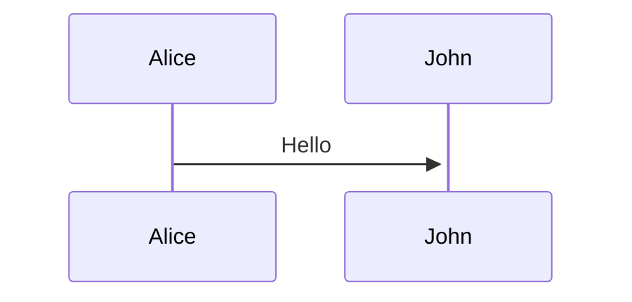
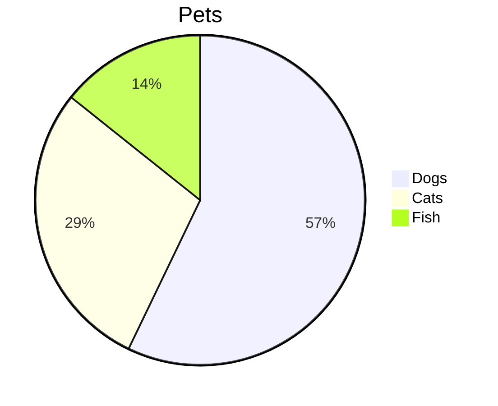
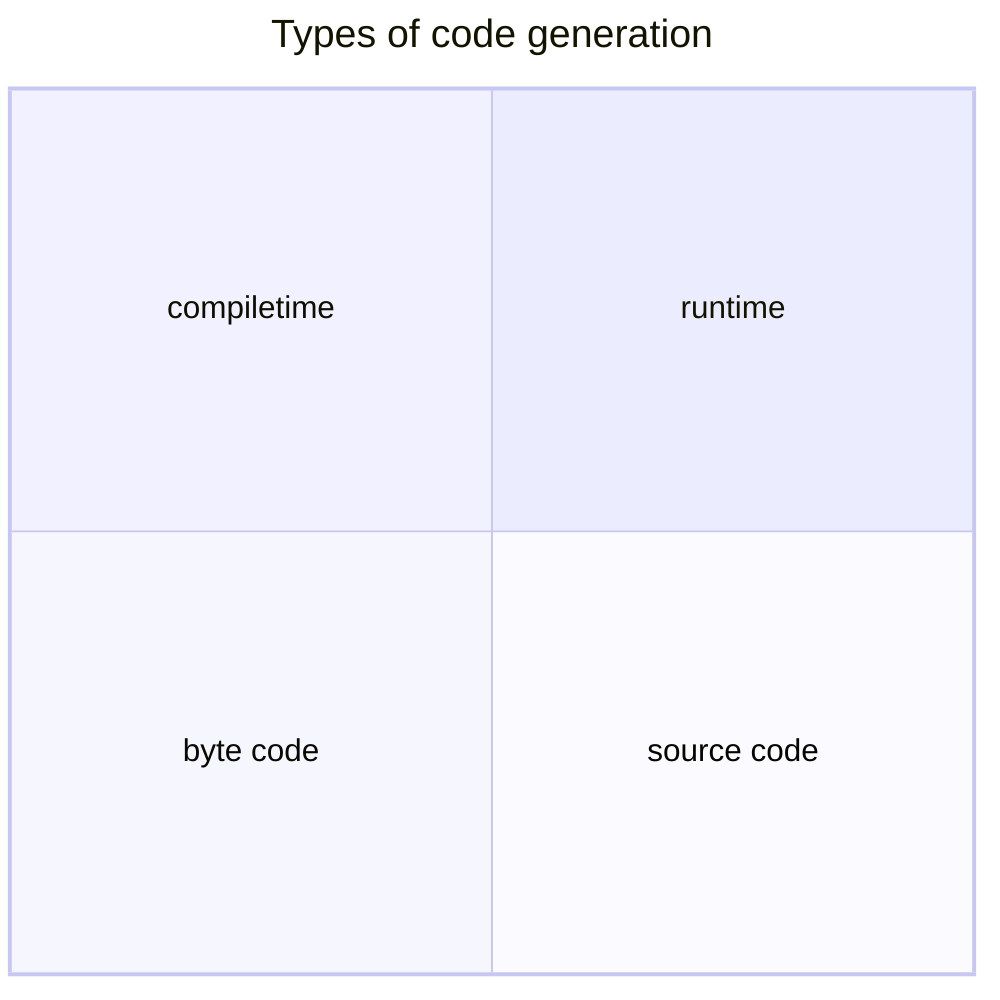

# talk-kotlin-poet

Live coding examples for talk: Kotlin Meta Programming

## Held on

* [code talks 2023, 14./15.09.](https://codetalks.de/program)

## Useful

* [reveal.js](https://revealjs.com/markdown/) - the slides framework
* [obsidian advanced slides](https://mszturc.github.io/obsidian-advanced-slides/) - reveal embedded in obsidian.
* [Kotlin Poet youtube](https://www.youtube.com/watch?v=V81HIASXBdQ)

